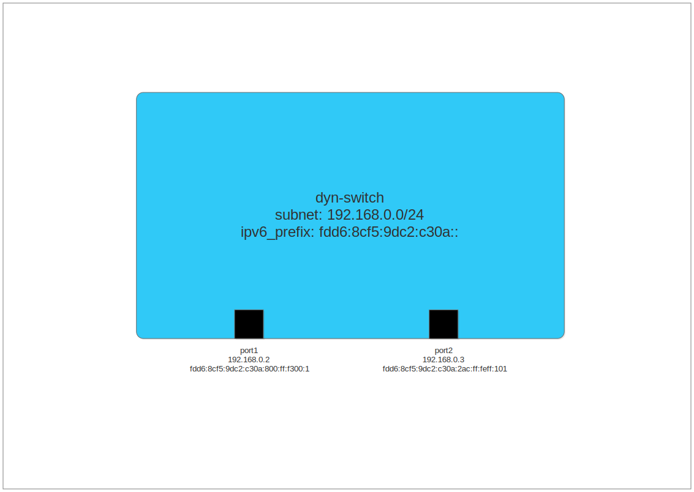
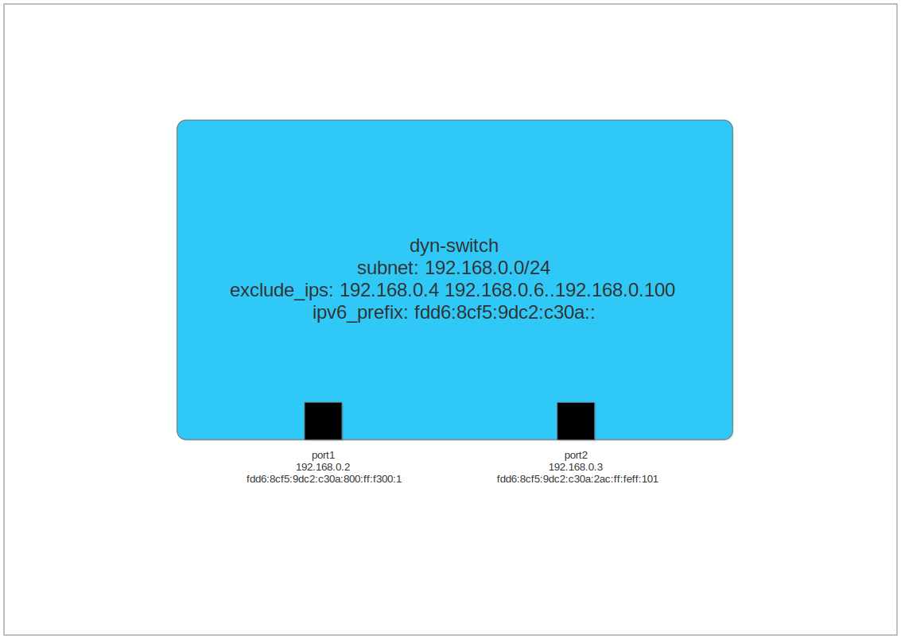

Looking around the internet, it's pretty easy to find high-quality tutorials
on basics of OVN. However, when it comes to more advanced topics, I sometimes
feel like the amount of ready information is lacking. In this tutorial, we'll
examine dynamic addressing in OVN. You will learn about IP address management
(IPAM) options in OVN and how to apply them.

One of the first things you'll learn when starting with OVN is how to create
logical switches and logical switch ports. You'll probably see something like
this:

````
ovn-nbctl ls-add sw
ovn-nbctl lsp-add sw sw-p1
ovn-nbctl lsp-set-addresses sw-p1 00:ac:00:ff:01:01 192.168.0.1
````

To recap, the first line creates a logical switch called "sw". The second line
adds a switch port to sw called "sw-p1". The final line sets the MAC and IP
address of sw-p1. It's pretty simple. But it requires you to manually keep
track of IP addresses for the switch ports. Is there a way we could create a
switch port without having to manually add the MAC and IP addresses?

## Dynamic Addressing

If you dig a bit deeper, you can find tutorials on the web that describe how to
set up OVN to provide IP addresses using DHCP. This saves you some configuration
steps on the VMs, but it doesn't help any on the OVN side. You still have to
specify an IP address on the logical switch port.

But is there some way that you can actually have OVN dynamically assign
addresses to switch ports? If you scrounge through the ovn-nb manpage, you might
be able to piece together the way to do it. This tutorial seeks to clear the air
so you can know exactly what tools are available to you and how to use them.

For our demonstration, we will use a very simple logical switch with two ports:


## Switch configuration

Let's start with the relevant options you can set, and then we'll look at some
examples that use these options. All of these are set as "other_config" on
logical switches.

- subnet: This is an IPv4 subnet, specified as a network address and mask. For
  example, 10.0.0.0/8 or 10.0.0.0/255.0.0.0

- exclude\_ips: This is a list of IPv4 addresses that should not be assigned to
  switch ports. You can either comma-separate individual addresses, or you can
  specify a range of addresses.

- ipv6\_prefix: This is an IPv6 network address of 64 bits. If you provide a
  longer address size than 64 bits, then those past the first 64 bits are
  ignored. The IPv6 address provided on each switch port is an EUI64 address
  using the specified prefix and the MAC address of the port.

Once you have these options set on your switch, it's then a matter of setting
your switch ports up to make use of these options. You can do this in one of two
ways.

Method #1:

````
ovn-nbctl lsp-set-addresses port 00:ac:00:ff:01:01 dynamic
````

Method #2:

````
ovn-nbctl lsp-set-addresses port dynamic
```` 

With method #1, you specify the MAC address, and with way #2, you allow for OVN
to allocate the MAC address for you.

## Demonstration

So let's go forth with an example where we do some basic setup:

````
ovn-nbctl ls-add dyn-switch
ovn-nbctl set Logical_Switch dyn-switch other_config:subnet=192.168.0.0/24 \
          other_config:ipv6_prefix=fdd6:8cf5:9dc2:c30a::
ovn-nbctl lsp-add dyn-switch port1 
ovn-nbctl lsp-set-addresses port1 dynamic
ovn-nbctl lsp-add dyn-switch port2
ovn-nbctl lsp-set-addresses port2 "00:ac:00:ff:01:01 dynamic"
````

With this setup, we've created a logical switch called "dyn-switch" and created
two ports called (inventively) "port1" and "port2".

So what happens when you do this? Let's take a look at the database contents for
the logical switch ports at the moment:

````
$ ovn-nbctl list logical_switch_port
_uuid               : 2d1fe408-f119-48d6-88c9-dff237c92856
addresses           : [dynamic]
dhcpv4_options      : []
dhcpv6_options      : []
dynamic_addresses   : "0a:00:00:00:00:01 192.168.0.2 fdd6:8cf5:9dc2:c30a:800:ff:fe00:1"
enabled             : []
external_ids        : {}
name                : "port1"
options             : {}
parent_name         : []
port_security       : []
tag                 : []
tag_request         : []
type                : ""
up                  : false

_uuid               : 43867394-8d3b-4e36-a90d-5f635d6a084c
addresses           : ["00:ac:00:ff:01:01 dynamic"]
dhcpv4_options      : []
dhcpv6_options      : []
dynamic_addresses   : "00:ac:00:ff:01:01 192.168.0.3 fdd6:8cf5:9dc2:c30a:2ac:ff:feff:101"
enabled             : []
external_ids        : {}
name                : "port2"
options             : {}
parent_name         : []
port_security       : []
tag                 : []
tag_request         : []
type                : ""
up                  : false
````

Notice the "dynamic_addresses" for the two switch ports. This database column is
automatically populated by ovn-northd based on IPAM configuration on the logical
switch. For port1, we specified "dynamic" for the addresses, so OVN created a
MAC address and IP addresses for us. You can recognize OVN-allocated MAC
addresses because they always start with "0a".

In picture form, our switch now looks like:



port1 was assigned the IPv4 address 192.168.0.2, and port2 was assigned the
address 192.168.0.3. Why does the addressing start with .2 instead of .1? OVN
reserves the first address of a subnet for the router that the switch attaches
to. In our case, there is no router, so no switch port was assigned 192.168.0.1.
The current algorithm of ovn-northd assigns addresses consecutively within the
subnet. For the rest of this tutorial, we will work knowing that this is how
ovn-northd operates. However, since the documentation does not state that this
is how dynamic IPv4 addressing works, it may be risky to rely on this behavior
in your application. A change in OVS versions may result in a change in
addressing.

The IPv6 addresses for each port are EUI64 addresses. The first 64 bits of the
address are the ipv6\_prefix that we configured. The rest of the address is
derived from the MAC address. When configuring an ipv6\_prefix, keep in mind
that even though only the first 64 bits of the address are used, OVN expects a
valid IPv6 address to be provided. Therefore, if you are providing 64 bits, be
sure to end the address with "::" so that OVN will process it as expected.

## Excluding IP addresses

Let's take a closer look into the exclude\_ips option. Let's set up exclude\_ips
and then set up additional ports to see what happens.

````
ovn-nbctl set Logical_Switch dyn-switch other_config:exclude_ips="192.168.0.4 \
              192.168.0.6..192.168.0.100"
````



Before continuing, let's take a closer look at the syntax. First, we specfied
one IP addresses, 192.168.0.4. This means that this individual IP address will
not be dynamically assigned. Next, we specified a range of IP addresses using
`..`. This is a lot more practical than spelling out the 95 IP addresses from
192.168.0.6 to 192.168.0.100. The quotation marks around the string are
necessary so that the shell does not interpret the spaces between addresses as
separate arguments to ovn-nbctl.

Only IPv4 addresses can be specified in exclude_ips. Since IPv6 addresses are
derived from the port's MAC address, there is no point in specifying any
excluded addresses.

And now let's set up two more ports on the switch.

````
ovn-nbctl lsp-add dyn-switch port3
ovn-nbctl lsp-set-addresses port3 dynamic
ovn-nbctl lsp-add dyn-switch port4
ovn-nbctl lsp-set-addresses port4 dynamic
````

Based on the pattern we had previously seen, we might expect for port3 to have
IP address 192.168.0.4. However, that address is in our excluded set of IP
addresses. Let's see what port3 has been assigned:

````
$ ovn-nbctl list logical_switch_port port3
_uuid               : 9dfee1d5-a279-4a06-a66e-5178b6f2f3e0
addresses           : [dynamic]
dhcpv4_options      : []
dhcpv6_options      : []
dynamic_addresses   : "0a:00:00:00:00:05 192.168.0.5 fdd6:8cf5:9dc2:c30a:800:ff:fe00:5"
enabled             : []
external_ids        : {}
name                : "port3"
options             : {}
parent_name         : []
port_security       : []
tag                 : []
tag_request         : []
type                : ""
up                  : false
````

It got assigned 192.168.0.5. And let's see what IP address got assigned to
port4:

````
$ ovn-nbctl list logical_switch_port port4
_uuid               : d7d20a60-2720-4056-904f-2f4ad3be4b0b
addresses           : [dynamic]
dhcpv4_options      : []
dhcpv6_options      : []
dynamic_addresses   : "0a:00:00:00:00:06 192.168.0.101 fdd6:8cf5:9dc2:c30a:800:ff:fe00:6"
enabled             : []
external_ids        : {}
name                : "port4"
options             : {}
parent_name         : []
port_security       : []
tag                 : []
tag_request         : []
type                : ""
up                  : false
````

It got assigned 192.168.0.101 since all addresses between 192.168.0.6 and
192.168.0.100 are in our excluded set.

Here is our final logical switch:


## What's to come

With all this, you should have the tools you need to set up IP addresses on your
logical switches without the need to keep track of assigned addresses in your
application.

But there's more to this than what I have presented here. In part 2 of this
blogpost, we'll look at some of the downsides in the IPAM implementation of OVN,
and we will delve into fixes that are coming in an upcoming version of OVN.
